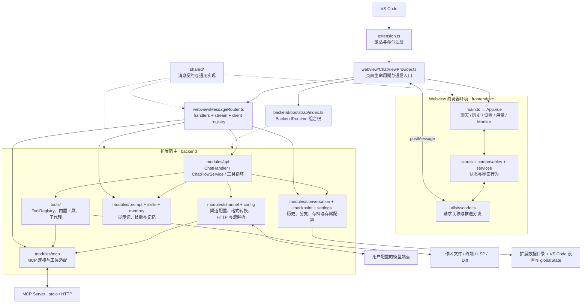
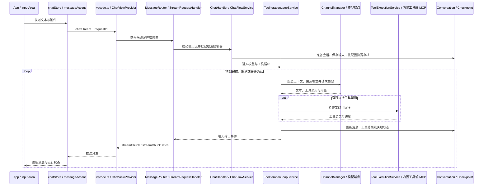
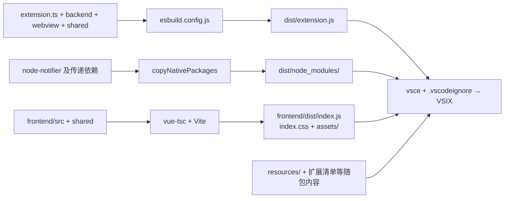

# GrayCode 项目结构与架构导航

> 整理日期：2026-09-05。源码基线：`1239458d`（`main`），扩展清单版本：`1.5.5`。
> 本文根据当前仓库的目录、导入关系、初始化代码、构建配置和测试配置整理。描述的是静态代码结构，不代表已经启动扩展或验证全部功能。

## 1. 项目定位与阅读入口

GrayCode 是一个 VS Code AI 编程助手扩展。扩展宿主负责模型请求、文件与终端工具、本地存储和 VS Code API；Vue Webview 负责聊天、设置、历史、统计与子代理监视界面。两侧通过 VS Code 的 `postMessage` 消息通道通信。

这里的 `backend/` 是扩展宿主内的 TypeScript 业务代码，`modules/api/` 是应用处理器层，当前主程序没有单独部署的 HTTP 后端服务。`frontend/` 有独立的 npm 清单和锁文件，通过根目录脚本的 `npm --prefix frontend` 调用。仓库还包含独立的 `fast-tavern-main/` 双语言提示词引擎子项目。

| 先看哪里 | 能了解什么 |
| --- | --- |
| [package.json](package.json) | 扩展身份、运行入口、VS Code 命令/视图/设置声明、构建与测试命令 |
| [extension.ts](extension.ts) | 扩展激活、聊天视图与命令注册、Diff UI、资源释放 |
| [backend/bootstrap/index.ts](backend/bootstrap/index.ts) | 后端实例如何创建、依赖如何注入、初始化与清理顺序 |
| [webview/ChatViewProvider.ts](webview/ChatViewProvider.ts) | Webview 生命周期、页面资源加载、启动握手、后端接线 |
| [shared/protocol.ts](shared/protocol.ts) | 跨端消息名、推送名、部分载荷校验、超时与非阻塞策略 |
| [frontend/src/App.vue](frontend/src/App.vue) | 界面入口、页面切换、发送/取消/编辑事件及全局推送处理 |
| [CONTRIBUTING.md](CONTRIBUTING.md) | 开发环境、调试方式、验证和贡献约定 |

### 技术与规模快照

| 范围 | 当前结构 |
| --- | --- |
| 扩展宿主 | TypeScript、Node.js API、VS Code API；清单要求 Node.js `>=20`、VS Code `^1.84.0` |
| Webview 界面 | Vue 3、Pinia、Vite、TypeScript；Markdown、代码高亮、KaTeX、Mermaid 渲染 |
| 打包 | esbuild 将扩展入口打成 CommonJS；Vite 构建 Webview 静态资源；vsce 打包 VSIX |
| 测试 | 后端 Jest / ts-jest；前端 Vitest / jsdom / Vue Test Utils；独立基准测试 |
| 附属提示词引擎 | TypeScript + tsup、Python + pytest；两个包版本均为 `0.1.8` |

以下数量按上述基线的 `git ls-files` 统计，包含各目录内已跟踪的源码、测试、配置或资源；不计依赖目录、忽略文件和本次新增文档。文件数用于定位规模，不等同于代码行数或测试用例数。

| 目录 | 已跟踪文件数 | 说明 |
| --- | ---: | --- |
| `backend/` | 767 | 业务模块、工具、公共基础设施与后端测试 |
| `frontend/` | 560 | Vue 界面、状态管理、前端测试和工程配置 |
| `webview/` | 56 | VS Code 页面宿主、消息处理与流式桥接 |
| `shared/` | 6 | 跨端共享协议及通用实现 |
| `fast-tavern-main/` | 84 | 独立提示词引擎，含 TS 与 Python 两套实现 |
| `resources/` | 15 | 图标、字体、音效及 Windows 通知程序 |
| `scripts/` | 10 | 元数据生成、国际化、测试辅助与发布辅助 |
| `test/` | 5 | 三个基准测试文件、基准支撑代码及说明 |

## 2. 整体架构图

实线表示主要调用或数据传递关系，虚线表示装配或共享契约依赖；图中省略了辅助依赖。



`backend/bootstrap` 用 `BackendRuntimeHooks` 接收 Webview 提供的事件回调和路由创建方法。由此可以从组合根追踪运行时依赖，而不用把所有实例创建逻辑都放进页面宿主。部分跨模块状态仍通过 `backend/core/settingsContext.ts` 和专用 bridge 共享；目录分层并不意味着模块之间完全没有运行时耦合。

## 3. 根目录结构

主树展示已跟踪的开发内容及本次新增文档。子目录只展开到能够辨认职责的层级。

```text
Gray-Code-main/
├── extension.ts                      # VS Code 扩展入口
├── package.json                      # 扩展清单、贡献点、依赖、npm 脚本
├── package-lock.json                 # 根工程 npm 锁文件
├── esbuild.config.js                 # 扩展 bundle 与外置依赖复制
├── tsconfig.json                     # 扩展侧类型检查范围
├── tsconfig.test.json                # 测试及跨端 TS 类型检查范围
├── jest.backend.config.js            # 后端 Jest 配置
├── backend/
│   ├── bootstrap/                    # 运行时装配
│   ├── core/                         # 日志、生命周期、锁、Diff、跨模块桥接
│   ├── modules/                      # 应用服务与领域模块
│   ├── tools/                        # 内置工具与子代理执行
│   ├── i18n/                         # 扩展侧中/英/日文案
│   └── __tests__/                    # 后端、Webview 桥接与跨端一致性测试
├── webview/
│   ├── ChatViewProvider.ts           # 主聊天视图宿主
│   ├── SubAgentMonitorPanel.ts       # 独立子代理监视面板
│   ├── MessageRouter.ts              # 请求分派、校验、响应路由
│   ├── messageHandlingQueue.ts       # 顺序执行与非阻塞调度
│   ├── startupBootstrap.ts           # 启动占位与前端延迟加载
│   ├── commands/                     # 设置命令、Diff/选区 UI 命令
│   ├── handlers/                     # 按功能拆分的消息处理器
│   ├── runtime/                      # Webview 客户端登记与投递
│   ├── stream/                       # 流式请求、输出批次、取消与旧流收尾
│   ├── utils/                        # 工作区、导入导出、配置通知等辅助
│   └── types.ts                      # HandlerContext 等接口
├── frontend/
│   ├── src/                          # Vue 应用，详见第 5 节
│   ├── index.html                    # Vite 浏览器入口模板
│   ├── preview.html                  # 开发预览页面
│   ├── package.json                  # 前端独立依赖与命令
│   ├── package-lock.json             # 前端 npm 锁文件
│   ├── vite.config.ts                # 本地开发、资源命名、构建输出
│   ├── vitest.config.ts              # 前端测试配置
│   ├── tsconfig.json                 # 前端严格类型检查
│   └── tsconfig.node.json            # 前端构建配置的 TS 配置
├── shared/                           # 消息协议、默认模板、codec 等共享源码
├── fast-tavern-main/                  # 独立提示词引擎子项目，详见第 9 节
├── resources/                        # 随扩展分发的静态资源
├── scripts/                          # 开发、生成与发布辅助
├── test/benchmark/                   # 长对话、分支图、存档性能基准
├── .github/workflows/                # CI、Nightly、正式 VSIX 发布
├── .vscode/                          # 调试启动、构建任务与编辑设置
├── .editorconfig                     # 编辑格式约定
├── .gitattributes                    # Git 文本与编码等属性
├── .gitignore                        # 本地依赖、产物与私有文件忽略规则
├── .vscodeignore                     # VSIX 打包排除规则
├── README.md / README_EN.md          # 产品入口及快速开始
├── CONTRIBUTING.md                   # 开发与贡献指南
├── CHANGELOG.md                      # 版本变化
├── KNOWN_ISSUES.md                   # 已记录问题与限制
├── LICENSE                           # 许可证
└── PROJECT_STRUCTURE.md              # 本文
```

### 当前本地目录中的其他内容

| 路径或模式 | 观察到的用途与管理方式 |
| --- | --- |
| `.git/` | Git 内部数据 |
| `node_modules/`、`frontend/node_modules/` | 已安装依赖，由 `.gitignore` 忽略 |
| `dist/` | 扩展构建产物，含 `extension.js`、可能存在的 source map 及外置依赖 |
| `frontend/dist/` | Webview 构建产物，包含入口 JS/CSS 与资源块 |
| 根目录 `*.vsix`、`release/*.vsix` | 历史或本地打包结果；文件被 `*.vsix` 规则忽略 |
| `.graycode/`、`.limcode/` | 本地设计、计划、进度、审查和临时工作资料 |
| `.claude/`、`.tmp/` | 本地工具配置、临时脚本与调查结果 |
| `docs/`、`report.md`、`AUDIT_REMEDIATION.md`、`*.plan.md` 中的现有历史计划 | 本地审查/整改记录；已观察到的这些记录被 Git 忽略 |
| `limcode-settings*.json` | 本地设置导出文件，已被忽略 |
| `*.log`、`run-logs.zip`、`splash-preview.html`、`diff_analyzer.py` | 本地日志或临时辅助文件，已被忽略 |
| `pnpm-lock.yaml` | 当前存在的旧锁文件；仓库维护 npm 锁文件并忽略此文件 |
| `ds客户端提示词注入/` | 本次查看时为空目录，没有已跟踪文件 |

此表只做结构定位，不读取或复制设置导出中的凭据。`release/` 目录本身没有专门忽略规则，其当前 VSIX 文件由扩展名规则排除。

## 4. 扩展后端：backend

### 4.1 装配入口与公共基础设施

[BackendRuntime.initialize()](backend/bootstrap/index.ts) 的主要顺序如下，实际错误处理与清理逻辑以该文件为准：

1. 初始化设置与通知服务，再确定有效数据路径和存储适配器。
2. 创建会话、用量索引和分支服务；旧历史迁移在后台执行。
3. 创建渠道配置管理器，初始化 Skills，注册内置工具与动态工具声明工厂。
4. 创建渠道、存档、完整性检查命令，以及 Chat / Models / Settings 应用处理器。
5. 初始化 MCP、记忆、活动统计、tokenizer、子代理执行上下文、更新与可选依赖管理。
6. 经注入的回调创建消息路由器，装配子代理与 Monitor，并安排延迟更新检查。

初始化失败时，组合根负责清理已创建的资源；Webview 保留错误并提供重试入口。

| 位置 | 职责 |
| --- | --- |
| `core/logger.ts`、`productMetadata.ts` | 日志输出与扩展产品元数据 |
| `core/RunController.ts`、`streamAbortBridge.ts`、`streamConstants.ts` | 运行作用域、流式取消桥接和共享时序常量 |
| `core/settingsContext.ts`、`subAgentAvailabilityBridge.ts` | 全局管理器引用与子代理可用性查询桥接 |
| `core/fileWriteLockManager.ts`、`chatFocusGuard.ts` | 文件写入锁与聊天焦点恢复协调 |
| `core/services/diffManager.ts`、`services/diff/` | 待审 Diff 的状态管理、差异算法和统计 |
| `core/services/agentMailbox.ts` | 主会话与子代理之间的消息、结果领取协调 |
| `core/parsers/promptToolParser.ts` | 提示词式工具调用解析 |
| `core/errors.ts`、`errorTypes.ts`、`deepMerge.ts` 等 | 错误分类、合并、比较与标识等基础能力 |

### 4.2 modules：业务模块导航

| 模块 | 主要入口与内部拆分 | 负责什么 |
| --- | --- | --- |
| `api/` | `chat/`、`channel/`、`models/`、`settings/`、`mcp/` | 面向调用方的应用处理器；聊天流转是其中最复杂的部分 |
| `channel/` | `ChannelManager.ts`、`formatters/`、`channelManager/`、`proxyFetch/`、`streamAccumulator/`、`tokenCount/` | 模型请求、协议格式、代理 HTTP、重试、流解析和 Token 计数 |
| `config/` | `ConfigManager.ts`、`storage.ts`、`configs/` | 渠道配置的类型、增删改查和持久化；区别于应用整体设置 |
| `conversation/` | `ConversationManager.ts`、`manager/`、`history/`、`branch/`、存储适配器 | 历史、元数据、分页、消息修改、分支、子代理记录与用量索引 |
| `checkpoint/` | `CheckpointManager.ts`、Snapshot / Backup / Restore / Query / Retention / Deletion 服务 | 工作区增量存档、清单、排除规则、预览恢复、保留与删除 |
| `settings/` | `SettingsManager.ts`、`SettingsCore.ts`、各 `*SettingsService.ts`、`types/` | 应用设置、模式工具策略、导入导出及存储路径迁移 |
| `prompt/` | `PromptManager.ts`、`contextSections.ts`、`fileTree.ts`、`pinnedFiles.ts`、缓存与模板辅助 | 系统提示词、动态工作区上下文、固定文件、模板组装与缓存 |
| `mcp/` | `McpManager.ts`、`StdioClient.ts`、`HttpClient.ts`、`mcpManager/`、`toolAdapter.ts` | MCP 连接、工具/资源/提示词列表、刷新、调用和结果适配 |
| `skills/` | `SkillsManager.ts`、`types.ts` | 技能发现、读取、启停、刷新与变更事件 |
| `memory/` | `MemoryManager.ts`、`MemoryLogStore.ts`、`cover.ts`、`configFile.ts` | 全局/工作区记忆、日志、摘要树、压缩及共享配置 |
| `activity/` | `ActivityTracker.ts`、`ActivityStore.ts`、`activityStats.ts` | 活动采样、按天落盘、连续使用时间和热力统计 |
| `tokenizer/` | `TokenizerResourceManager.ts`、`converters.ts` | tokenizer 词表的运行时资源管理与转换 |
| `dependencies/` | `DependencyManager.ts` | 可选依赖状态、安装/卸载、加载和进度 |
| `notifications/` | `WindowsAgentStopNotificationService.ts`、Toast adapters、焦点/标题/模板辅助 | Windows 停止/完成通知及窗口聚焦 |
| `update/` | `UpdateChecker.ts` | stable / nightly 更新检查与安装流程 |

渠道的代码类型目前有五种：`gemini`、`gemini-interactions`、`openai`、`anthropic`、`openai-responses`，在 [configs/base.ts](backend/modules/config/configs/base.ts) 与 [formatters/index.ts](backend/modules/channel/formatters/index.ts) 对照。README 按产品使用方式概括渠道时，应与这里的代码枚举区分。

`channel/deepseekVision.ts` 和 `deepseekVisionCache.ts` 承担特定视觉请求的预处理与缓存；可选图片/PDF 依赖由 `dependencies/` 管理。`channel/opencodeSession.ts` 集中处理 OpenCode 会话兼容相关信息。

### 4.3 聊天核心：api/chat

```text
backend/modules/api/chat/
├── ChatHandler.ts                    # 对外聊天处理入口及服务接线
├── handlers/StreamResponseProcessor.ts
│                                     # 模型流响应处理
├── services/
│   ├── ChatFlowService.ts             # 主流程门面
│   ├── flow/                         # 主回合、重试、重新生成、编辑分支
│   ├── ToolIterationLoopService.ts    # 模型调用与工具执行循环
│   ├── toolIterationLoop/            # 工具确认、早执行、结算和存档协调
│   ├── ToolExecutionService.ts        # 工具执行门面
│   ├── tool-execution/               # 执行前检查、执行、mailbox 和结果处理
│   ├── ContextTrimService.ts          # 上下文裁剪入口
│   ├── contextTrim/                  # 窗口预算、历史选择、组装及回退策略
│   ├── SummarizeService.ts            # 总结生成与恢复相关处理
│   ├── MessageBuilderService.ts       # 消息组装
│   ├── ToolCallParserService.ts       # 工具调用解析
│   ├── TokenEstimationService.ts      # Token 估算
│   ├── CheckpointService.ts           # 聊天流程中的存档协调
│   ├── DiffInterruptService.ts        # Diff 中断与待审状态协调
│   └── ...                           # 取消收尾、审批规则、重复调用等辅助
├── types.ts                          # 聊天请求和结果类型
└── utils.ts                          # 聊天辅助类型与函数
```

这里需要区分两个名字相近的服务：`backend/.../handlers/StreamResponseProcessor.ts` 处理模型侧响应，`webview/stream/StreamChunkProcessor.ts` 将聊天输出整理为界面消息。它们处于同一调用链的不同位置。

### 4.4 tools：工具执行与工作流

工具执行入口是 [ToolRegistry.ts](backend/tools/ToolRegistry.ts)，注册汇总在 [tools/index.ts](backend/tools/index.ts)。工具按工厂注册，声明的动态重建由 `toolDeclarationRegistry.ts` 与渠道侧 `ToolDeclarationResolver.ts` 配合；参数处理集中在 `coerceToolArgs.ts`、`validateToolArgs.ts`、`toolSchema.ts`。

| 子目录 | 工具或辅助职责 |
| --- | --- |
| `file/` | 读写、列举、建目录、删除、插入/删除代码、apply_diff；含 `diff/` 算法与审阅 UI providers |
| `search/` | 文件查找、内容搜索与替换、编码处理 |
| `terminal/` | 命令执行、shell 配置、进程管理与输出解码 |
| `lsp/` | 符号、定义跳转、引用查询与 LSP 生命周期辅助 |
| `media/` | 图片生成、裁剪、缩放、旋转、去背景及图片辅助 |
| `todo/` | TODO 写入与更新 |
| `design/` | 设计文档创建与更新 |
| `plan/` | 计划文档、来源资料区段和 TODO 区段 |
| `progress/` | 进度文档、里程碑、自动同步、结构校验 |
| `review/` | 审查文档、里程碑、比较、完成/重新打开与校验 |
| `history/` | 历史搜索与结果虚拟文档 |
| `skills/` | `read_skill` 工具及其注册 |
| `memory/` | note / recall / wake / zoom / compress / forget / config |
| `subagents/` | 子代理配置注册、执行、并发限制、通信、后台运行、记录及事件总线 |
| `activity/` | 使用时间统计工具 |
| `notification/` | Windows 通知工具 |
| `maintenance/` | 存档、历史与分支完整性诊断及 VS Code 命令 |
| `localization/` | 工具声明文案、语言目录与动态描述本地化 |
| `shared/` | 路径策略、工作区路径、并发、文件大小、文本及多模态通用辅助 |

`taskManager.ts` 统一管理终端、图片生成和后台子代理等异步任务及事件。子代理的进一步入口是 `subagents/executor.ts`、`subagents/executor/` 与 `subagents/eventBus/`；界面监视功能对应 `webview/SubAgentMonitorPanel.ts` 和前端 `components/subagents/`。

## 5. Webview 前端：frontend/src

```text
frontend/src/
├── main.ts                           # 创建 Vue/Pinia、注册工具、载入样式并挂载
├── App.vue                           # 主聊天与 Monitor 两种界面入口
├── build/webviewAssetNaming.ts        # 稳定的入口样式与异步资源命名
├── components/
│   ├── home/                         # 欢迎页
│   ├── header/                       # 标题栏组件
│   ├── tabs/                         # 对话标签页
│   ├── input/                        # 输入框、模型/渠道/模式选择、附件与队列
│   │   └── inputBox/                 # 编辑器节点、光标和历史等输入行为
│   ├── attachment/                   # 附件列表与预览
│   ├── message/                      # 消息列表、渲染、Diff、分支与任务卡片
│   │   ├── messageItem/              # 单条消息的辅助逻辑
│   │   ├── messageTaskCards/          # 工作流任务卡辅助
│   │   ├── toolMessage/               # 工具消息展示辅助
│   │   ├── responseViewer/            # 工具结果数据与展示适配
│   │   └── responseViewerDialog/      # 结果弹窗辅助
│   ├── history/                      # 会话历史页面与列表
│   ├── settings/                     # 设置面板及各功能设置
│   ├── usage/                        # Token/费用与使用时间页面
│   ├── subagents/                    # 子代理监视与上下文压缩状态
│   ├── backgroundTasks/              # 后台任务栏
│   ├── tools/                        # 按工具种类拆分的 Vue 结果组件
│   ├── common/                       # 通用弹窗、控件、Markdown、滚动和 Diff 组件
│   ├── Splash.vue                    # 开屏动画
│   └── StartupBackdrop.vue           # 启动占位
├── stores/
│   ├── chatStore.ts                  # 聊天状态与操作聚合入口
│   ├── chat/                         # 状态、计算属性、消息/标签/分支/队列/流操作
│   │   ├── messageActions/           # 发送、重试、删除和总结流程
│   │   └── chunkHandlers/            # 文本、工具、终态、总结分块处理
│   ├── settingsStore.ts              # 前端设置与当前视图状态
│   ├── terminalStore.ts              # 终端输出状态
│   ├── backgroundTaskStore.ts        # 后台任务状态
│   ├── backgroundTasks/              # 后台结果报告与聊天桥接
│   └── agentRun/                     # 运行事件、reducer、selectors 与内容增量
├── composables/                      # 附件、设置保存、存档、导航、音效等 Vue 组合逻辑
├── services/                         # 配置缓存、上下文/技能服务、声音与通知编排
├── utils/
│   ├── vscode.ts                     # VS Code 消息通信接口
│   ├── extensionMessageRouting.ts    # 请求响应与主动推送分类
│   ├── toolRegistry.ts               # 前端工具展示注册器
│   ├── tools/                        # 各工具的展示元数据与描述格式化
│   │   └── __generated__/toolMeta.ts # 从后端声明生成的静态元数据
│   └── ...                           # Token、Diff、流平滑、文件、任务卡等辅助
├── i18n/                             # 中/英/日语言包及共享文案镜像
├── styles/                           # tokens.css、primitives.css 与样式说明
├── style.css                         # 应用级样式
├── types/                            # 前端消息、编辑器、渠道与设置等类型
├── __tests__/                        # 组件、store、service、composable 与工具测试
├── vitest.setup.ts                   # jsdom 与语言环境测试初始化
└── vite-env.d.ts                     # Vite 与 Webview 全局类型
```

`App.vue` 将 `MessageList`、历史、统计、设置和 Monitor 作为异步组件加载。`settingsStore.currentView` 与 `useViewNavigation` 决定页面切换和访问后的挂载保留；Monitor 通过 `window.__GRAYCODE_VIEW_MODE` 复用前端入口，并跳过主聊天时间线初始化。

聊天逻辑从 `chatStore.ts` 聚合到 `stores/chat/`。定位发送问题时，可继续查看 `messageActions/sendMessageFlow.ts`；定位流式显示时，查看 `streamHandler.ts`、`streamChunkHandlers.ts`、`chunkHandlers/` 和 `smoothStreamManager.ts`。长消息列表还涉及 `windowUtils.ts`、`visibilityUtils.ts` 与 `components/message/useVirtualMessageWindow.ts`。

设置组件继续按 `channels/`、`channelSettings/`、`checkpoint/`、`mcpSettings/`、`memorySettings/`、`panel/`、`prompt/`、`subAgentsSettings/` 和 `tools/` 拆分。前端的 `components/tools/`、`utils/tools/`、`components/settings/tools/` 分别对应工具结果组件、展示元数据、工具设置；实际执行仍在后端。

## 6. 通信协议与一次聊天的路径

### Webview 桥接层

| 入口 | 职责 |
| --- | --- |
| `ChatViewProvider.ts` | 生成 HTML 与 CSP、装配后端、处理主视图握手和生命周期、转发命令与事件 |
| `MessageRouter.ts` | 识别流式/普通请求、校验已登记 schema、分派处理器、维护 requestId → clientId 响应路由 |
| `handlers/index.ts` | 汇总各功能的消息处理器注册 |
| `handlers/*Handlers.ts` | 聊天、会话、分支、存档、设置、MCP、记忆、技能、文件、统计和更新等接口 |
| `handlers/file/` | 文件读/查找/预览/打开、固定文件及公共辅助的进一步拆分 |
| `stream/StreamRequestHandler.ts` | 聊天/重试/工具确认/取消等流式请求的生命周期 |
| `stream/StreamChunkProcessor.ts` | 流式结果转为界面推送、分块/批次输出 |
| `stream/StreamAbortManager.ts`、`stream/abort/` | 请求取消、控制器登记与退休旧流的完成等待 |
| `runtime/WebviewClientRegistry.ts` | 主聊天与 Monitor 客户端登记、可达性和消息投递 |
| `messageHandlingQueue.ts` | 普通消息的队列调度与握手等特殊消息处理 |



图中概括主路径；工具早执行、审批暂停和取消结算有各自的并发处理。长流及已标记的非阻塞请求不会一直占用普通消息队列，取消、工具确认和新请求因此有独立的处理机会。

[shared/protocol.ts](shared/protocol.ts) 是请求名 `MESSAGE_NAMES`、推送名 `PUSH_MESSAGE_NAMES`、超时豁免集合和非阻塞集合的共同来源。`UNBOUNDED_REQUEST_TYPES` 决定前端等待策略，`NON_BLOCKING_MESSAGE_TYPES` 决定后端队列调度，两者职责不同。载荷 schema 只覆盖已登记的消息，其余仍由各处理器校验。

### shared 的六个文件

| 文件 | 用途 |
| --- | --- |
| `protocol.ts` | 消息常量、部分校验器、ContentPart / Usage / Checkpoint 等跨端类型 |
| `defaultPromptTemplates.ts` | 前后端共用的默认提示词模板 |
| `mcpToolNameCodec.ts` | MCP 工具名编码与解码 |
| `regexGuard.ts` | 正则校验与执行保护的共享实现 |
| `subAgentContextCompaction.ts` | 子代理上下文压缩状态类型 |
| `uriParseShim.ts` | 文件 URI 转换辅助 |

## 7. 运行数据存储结构

运行数据的根目录由 [StoragePathManager.ts](backend/modules/settings/StoragePathManager.ts) 决定：默认使用 VS Code 的 `context.globalStorageUri`，自定义目录由存储设置及迁移状态解析。下图是代码定义的布局，不是对当前用户数据目录的扫描。

```text
<有效数据目录>/
├── conversations/
│   ├── <conversationId>.meta.json    # 会话元数据，含相关自定义状态
│   ├── <conversationId>.usage.json   # 用量索引
│   ├── <conversationId>.json         # 兼容读取的旧版历史
│   └── <conversationId>/
│       ├── history.index.json        # 分段历史索引
│       ├── history/*.ndjson          # 历史分段
│       ├── branches.json             # 分支图 sidecar
│       └── subagents/<runId>.json    # 子代理对话记录
├── snapshots/                        # 对话历史快照
├── checkpoints/<checkpointId>/       # 工作区文件存档、清单与备份数据
├── diffs/                            # 从消息中抽离的大型 Diff 内容
├── mcp/servers.json                  # MCP 服务配置
├── dependencies/                     # 运行时可选依赖
├── skills/                           # 数据目录中的技能资源
├── activity/                         # 按日活动数据
├── tokenizers/                       # 词表资源缓存
├── memory/                           # 全局记忆 LOG/TREE 及共享 config
├── memory-workspaces/<hash>/         # 各工作区独立的记忆数据
└── branches.config.json              # 分支保留配置
```

会话历史由 `FileSystemStorageAdapter`、`TranscriptRepository` 与 `TranscriptMutation` 等维护，分支图由 `BranchGraphRepository` 和 `BranchService` 管理，用量索引由 `FileUsageIndexStore` 维护。工作区文件存档由 `checkpoint/` 管理，和 `snapshots/` 的对话快照用途不同。

存储还包括两条路径：应用设置主要通过 `VSCodeSettingsStorage` 进入 VS Code 配置；渠道配置由 `MementoStorageAdapter(context.globalState, 'graycode.configs')` 保存。默认数据路径中的 `settings/` 用于旧设置兼容。修改存储功能时，要同时查看设置、globalState 和文件数据的实际写入路径。

工作流文档的路径规则则在 `tools/design/`、`tools/plan/`、`tools/progress/`、`tools/review/` 内定义，落到工作区；它们与扩展数据目录的对话记录分开管理。

## 8. 构建、资源与测试

### 构建产物流向



扩展后端构建不代替完整类型检查。`esbuild.config.js` 输出 Node 20 目标的 CommonJS，保留可读代码；watch 模式开启 source map，单次构建可通过 `--sourcemap` 开启。`vscode` 由宿主提供，`node-notifier` 及其传递依赖复制到 `dist/node_modules/`。

VS Code Webview 的实际 HTML 由 `ChatViewProvider` 生成，生产模式引用 `frontend/dist` 中的入口资源；`frontend/index.html` 是 Vite 入口模板。`webviewAssetNaming.ts` 保持主样式 `index.css` 的稳定名称，为异步 CSS 分配独立名称。

本地开发配置在 `.vscode/launch.json` 和 `.vscode/tasks.json`：`Run Extension (Local Vite Dev)` 同时启动后端 watch 与 Vite，通过 `GRAYCODE_WEBVIEW_DEV_SERVER_URL` 指向 `127.0.0.1:5173`。

### 资源与生成脚本

| 路径 | 用途 |
| --- | --- |
| `resources/icon.png`、`icon.svg` | 扩展及活动栏图标 |
| `resources/codicons/`、`file-icons/` | UI 图标样式、字体及图标数据 |
| `resources/sound/` | 完成、错误、警告等音效 |
| `resources/bin/toast-linger.exe` | 随包 Windows 通知辅助程序 |
| `scripts/toast-linger/` | 上述程序的 C# 源码、项目、构建脚本与说明 |
| `scripts/generate-tool-meta.mjs` | 从后端声明生成前端 `utils/tools/__generated__/toolMeta.ts`；支持 `--check` |
| `scripts/i18n-sync.mjs`、`i18n-shared-manifest.json` | 共享文案生成/同步与一致性检查 |
| `scripts/i18n-inventory-snapshot.md` | 国际化清单快照 |
| `scripts/extract-release-notes.mjs` | 从版本记录提取发布说明 |
| `scripts/run-fast-tavern-py.mjs` | Python 解释器/虚拟环境准备及子项目测试入口 |

工具静态描述从后端生成；图标、标签、专用 Vue 组件等前端展示信息仍有手工维护部分。新增工具应同时核对两端注册、设置、展示与测试。

### 测试布局和命令

当前基线有 **287 个后端 `.test.ts` 文件、112 个前端 `.test.ts` 文件、3 个 `.benchmark.ts` 文件**。这是文件盘点；本次整理文档没有执行这些功能测试。

| 范围 | 位置与配置 |
| --- | --- |
| 后端与 Webview | `backend/__tests__/`，按 `api/channel/conversation/checkpoint/tools/webview` 等域分组；Jest 使用 VS Code mock 和公共 fixtures |
| 跨端一致性 | 后端测试中的 `parity/`、`i18n/`，覆盖 codec、正则、工具元数据、语言包等 |
| 前端 | `frontend/src/__tests__/` 及组件、store、utils 等目录内就近放置的 `__tests__/`；Vitest 使用 jsdom |
| 性能基准 | `test/benchmark/`：长对话、分支图、检查点；详见其 [README](test/benchmark/README.md) |
| fast-tavern | TS 的 `test/test.mjs` 与 Python 的 `tests/test_fast_tavern_parity.py` |

| 根目录命令 | 实际用途 |
| --- | --- |
| `npm ci`、`npm --prefix frontend ci` | 安装主扩展和前端锁定依赖 |
| `npm run typecheck:all` | 后端、测试 TypeScript 与前端类型检查 |
| `npm run build:backend` / `npm run compile` | 构建扩展 bundle |
| `npm run build:frontend` | 前端类型检查与 Vite 构建 |
| `npm run build` | 顺序构建扩展后端和前端 |
| `npm run watch` / `npm run dev:frontend` | 后端监听构建 / 本地 Vite 开发 |
| `npm test -- --runInBand` | 后端 Jest 测试 |
| `npm run test:frontend` / `npm run test:all` | 前端测试 / 后端与前端测试 |
| `npm run test:coverage` | 后端覆盖率 |
| `npm run test:fast-tavern-ts` / `npm run test:fast-tavern-py` | 两个附属包的测试；脚本包含依赖准备步骤 |
| `npm run i18n:check` | 国际化同步检查 |
| `node scripts/generate-tool-meta.mjs --check` | 工具元数据生成一致性检查 |
| `npm run benchmark` | 单独运行性能基准 |
| `npm run ci` | 类型检查、前后端测试、两个 fast-tavern 测试及 i18n 检查 |
| `npx @vscode/vsce package` | 打包 VSIX；触发 `vscode:prepublish`，进而执行 `npm run build` |

CI 工作流共三个：[ci.yml](.github/workflows/ci.yml) 执行常规检查；[nightly-build.yml](.github/workflows/nightly-build.yml) 增加 Nightly 构建、基准和 Windows 测试等步骤；[release.yml](.github/workflows/release.yml) 验证并打包正式发布产物。`npm run ci` 本身不包含 `npm run build`，发布时由 vsce 的预发布脚本触发构建。

## 9. 独立子项目：fast-tavern-main

```text
fast-tavern-main/
├── README.md                         # 双语言包总览
├── npm-fast-tavern/
│   ├── src/index.ts                  # TypeScript 包公开入口
│   ├── src/core/
│   │   ├── channels/                 # gemini / openai / tagged / text 输出
│   │   ├── modules/                  # 输入、历史、世界书、宏、变量、正则、组装流水线
│   │   ├── convert.ts                # 格式转换出口
│   │   └── types.ts                  # 引擎数据结构
│   ├── test/test.mjs                  # 基于构建产物的测试
│   ├── docs/                         # 已跟踪的 API、格式与使用指南
│   ├── package.json / package-lock.json
│   ├── tsconfig.json
│   └── tsup.config.ts                # ESM / CJS / 类型声明构建
└── py-fast-tavern/
    ├── src/fast_tavern/__init__.py    # Python 包公开入口
    ├── src/fast_tavern/core/
    │   ├── channels/                 # 与 TS 对应的输出转换
    │   └── modules/                  # 与 TS 对应的提示词流水线
    ├── tests/                        # pytest 行为对齐测试
    ├── pyproject.toml                # 包配置；Python >=3.10
    └── README.md
```

该引擎组装预设、世界书、角色卡、正则脚本、宏/变量和聊天历史，输出多阶段提示词结果。两套实现分别维护自己的包与测试。TS 包的 `docs/` 中有三个已跟踪的指南；虽然 `docs/` 忽略规则也匹配此目录，Git 仍继续跟踪已有文件，不能只用默认文件搜索结果判断它们是否存在。

本次在主扩展的 `extension.ts`、`backend/`、`webview/`、`frontend/src/` 中未找到对 fast-tavern 的直接源码引用；根工程通过测试脚本把它纳入 CI，`.vscodeignore` 将其排除出 VSIX。当前应将它理解为同仓维护的独立子项目，主聊天上下文入口仍是 `backend/modules/prompt/`。

## 10. 按需求定位代码

| 要研究或修改的功能 | 建议起点 | 继续核对的联动位置 |
| --- | --- | --- |
| 激活、启动失败、页面加载 | `extension.ts`、`ChatViewProvider.ts`、`bootstrap/index.ts` | `startupBootstrap.ts`、`App.vue`、Vite 资源命名 |
| 消息发送、重试、编辑 | `stores/chat/messageActions/`、`api/chat/ChatHandler.ts` | `ChatFlowService.ts`、`services/flow/`、会话写入 |
| 流式、取消、消息队列 | `webview/stream/`、`MessageRouter.ts` | `core/streamAbortBridge.ts`、`ToolIterationLoopService.ts`、前端 stream handlers |
| 新增跨端消息 | `shared/protocol.ts` | Webview 注册、前端 `sendToExtension`/推送处理、对应测试 |
| 新增模型渠道或请求参数 | `modules/config/configs/`、`channel/formatters/` | `ChannelManager`、渠道设置组件、声明与格式转换测试 |
| 新增内置工具 | `backend/tools/<类别>/`、`tools/index.ts` | 动态声明工厂、工具策略、前端元数据/组件/设置、生成一致性测试 |
| 对话历史、分支与存档 | `modules/conversation/`、`conversation/branch/`、`checkpoint/` | Branch / Checkpoint handlers、前端 branch/checkpoint actions 和 UI |
| 上下文裁剪与总结 | `api/chat/services/contextTrim/`、`SummarizeService.ts` | `prompt/`、总结/Token 设置、前端总结状态 |
| MCP、Skills、永久记忆 | 对应 `modules/` 与 `tools/` 目录 | 对应 Webview handlers、设置组件、共享 codec |
| 子代理和后台任务 | `tools/subagents/`、`taskManager.ts` | `agentMailbox`、Monitor 面板、`stores/agentRun/` 与后台结果桥接 |
| Token/费用和活动统计 | `conversation/usageStats.ts`、`UsageIndexStore.ts`、`activity/` | Usage / Activity handlers、`components/usage/` |
| 设置、导入导出与迁移 | `SettingsManager.ts`、各设置服务、`StoragePathManager.ts` | Settings / SettingsTransfer / StoragePath handlers、前端 composables |
| 国际化与工具描述 | `backend/i18n/`、`frontend/src/i18n/`、`tools/localization/` | `i18n-sync.mjs`、`generate-tool-meta.mjs`、parity 测试 |
| 打包、更新和通知 | `esbuild.config.js`、`.vscodeignore`、`modules/update/`、`modules/notifications/` | GitHub workflows、`resources/`、C# Toast 辅助程序 |

以上表格中的缩写路径均相对前文对应的 `backend/`、`webview/` 或 `frontend/src/` 根目录。

### 维护本文时需要同步的内容

目录或入口调整后，更新目录树、代码导航和模块图；协议改动同时核对两端；新增工具同时核对执行、声明、展示与生成物；存储改动同时核对历史、元数据、分支、用量索引及存档关联。大门面文件如 `ConversationManager`、`SettingsManager`、`ChatViewProvider` 已有职责拆分，阅读和修改时应继续追踪其委托的子服务。

文档中的版本、数量和本地额外文件是本次快照。根扩展版本当前为 `1.5.5`，前端私有包版本仍为 `1.5.4`；扩展运行时产品版本由根扩展清单初始化。判断某项功能的现状应以源码、清单与有效配置为准，历史变更记录和本地审查笔记用于补充背景。
