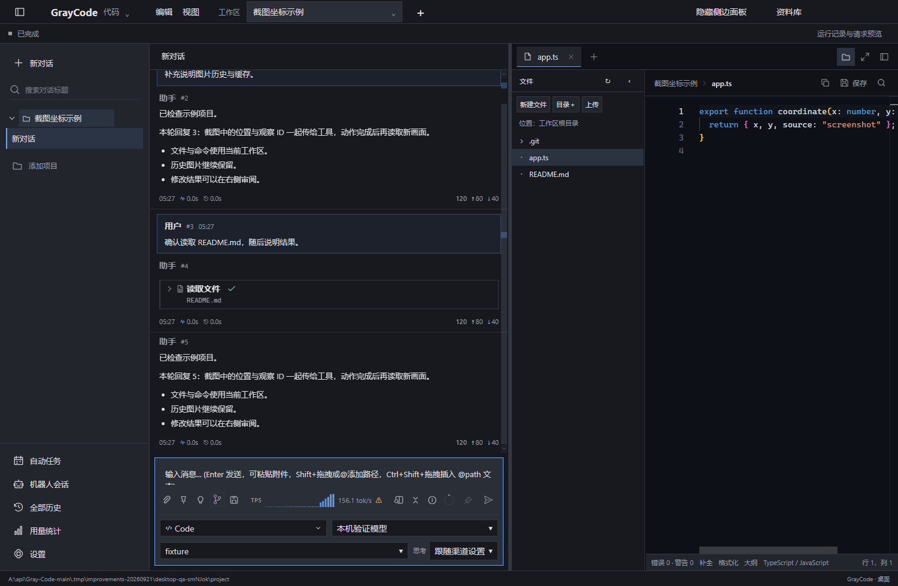
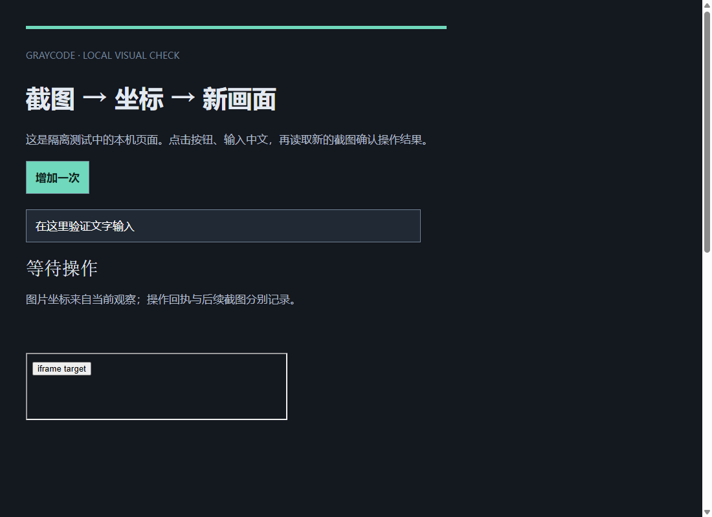

# GrayCode

**本地优先的 AI 工作台：对话、代码、截图操作与代理任务。**

[English](README_EN.md) · [使用手册](wiki/Home.md) · [下载发行版](https://github.com/Komeiji-Shiki/Gray-Code/releases) · [开发指南](CONTRIBUTING.md)

GrayCode 将模型对话、代码编辑、终端、Git 审阅和工具执行放在同一个独立桌面应用中。可以接入自己的模型渠道，让模型根据截图操作电脑或内置浏览器，也可以调用 MCP 工具、Skills、子代理和外部 ACP 编码代理。会话、附件、任务和记忆保存在本地，桌面、Web、Bot 与远程设备共用任务服务。

当前源码版本为 **2.0.0-pre.2**，Windows x64 是本次构建与验证的平台。发行页附件对应各自的发布提交，未发布的主线改进需要从源码构建。1.x VS Code 扩展保留在 [v1-extension](https://github.com/Komeiji-Shiki/Gray-Code/tree/v1-extension) 分支。

## 开始使用

1. 从[发行页面](https://github.com/Komeiji-Shiki/Gray-Code/releases)选择 Windows 包。便携版完整解压后运行 GrayCode.exe；安装版使用相应 Setup 程序。
2. 打开应用唯一的设置入口，在“渠道”添加自己的接口地址、凭据和模型。支持 OpenAI Chat Completions、OpenAI Responses、Anthropic 与 Gemini 格式。
3. 选择工作区，输入任务。工作台可以同时显示对话、文件、编辑器、终端、差异与浏览器；只聊天时也可以不绑定项目。

例如：“阅读这个项目，定位文件树卡顿的原因，修复后运行相关检查。”

设置分类共用草稿，通过“保存全部”提交。模式切换保留当前会话；“新建任务”才创建另一段会话。[安装、配置与第一次任务](wiki/Getting-Started.md)介绍完整流程。

## 能做什么

| 工作 | 当前能力 | 详细说明 |
| --- | --- | --- |
| 模型对话 | 多渠道、思考设置、流式回复、编辑重试、重生成、候选分支、附件与长上下文 | [模型与上下文](wiki/Models-and-Context.md) |
| 编码 | 文件搜索、代码编辑、语言服务、交互终端、Git 差异与工作树任务 | [编码与工作树](wiki/Coding-and-Worktrees.md) |
| 视觉操作 | 电脑截图、图片坐标点击/拖动/输入，内置浏览器截图与后台操作 | [截图与坐标](wiki/Visual-Tools.md) |
| 工具与代理 | Skills、新旧 MCP、原生子代理、团队任务、外部 ACP 会话 | [工具与代理](wiki/Agents-and-MCP.md) |
| 自动执行 | 目标任务、定时与事件触发、暂停/继续、子任务结果回流 | [自动任务与多端](wiki/Automation-and-Devices.md) |
| 多端协作 | Web 工作台、Discord、OneBot、配对设备任务与远程画面控制 | [自动任务与多端](wiki/Automation-and-Devices.md) |
| 数据与诊断 | 本地历史、永久记忆、备份恢复、请求快照、图片计数与资源状态 | [存储与诊断](wiki/Data-and-Diagnostics.md) |

### 通过截图操作

启用所选渠道的多模态能力后，工具截图会作为图片内容进入模型请求。电脑默认返回截图和简要观察信息，完整控件树按需读取；浏览器同时支持截图坐标和现有 DOM/元素操作。一次动作完成后返回新画面，便于模型继续判断。

坐标绑定产生它的那次观察。页面缩放、窗口位置或控制权改变时需要重新观察；动作已经完成但截图失败时，记录会分别说明两种结果。同一操作的重试使用原回执，避免重复点击。

**新增图片不会自动移除历史图片。** 历史中的参考图和工具截图继续按顺序发送，已经删除“最近 N 张图片”的设置。稳定的系统提示、工具声明和历史前缀有利于供应方的提示缓存；实际命中率和价格由模型端决定。详情见[图片与缓存](wiki/Models-and-Context.md#图片与请求前缀)。

### 使用外部编码代理

在“设置 → 开发”添加支持 ACP 的本机程序。Kimi Code 可使用命令 kimi 和单个参数 acp，也可以配置已安装的其他 ACP 适配器。登录与模型由该程序管理。

模型通过稳定的 coding_agent 工具创建、继续、恢复、派生或关闭会话。每次只追加新的提示和附件；具体权限选项会显示在当前任务中。断线且无法确认结果时保留记录，不自动重放操作。详见[ACP 配置与会话](wiki/Agents-and-MCP.md#外部-acp-编码代理)。

## 本次性能改进

下列结果来自同机合成夹具，说明对应模块的变化，不代表任意真实项目的整体性能。

| 场景 | 改进前 | 改进后 |
| --- | ---: | ---: |
| 8,000 条文件树，挂载与布局中位数 | 787.5 ms，40,011 个 DOM 元素 | 21.8 ms，204 个 DOM 元素 |
| 8,000 条消息，活跃历史未变化时读取 | 约 99 ms，完整历史约 5.36 MB | 约 0.22 ms，增量响应 385 B |
| 8,000 × 768 维向量的混合检索中位数 | 108.84 ms | 66.17 ms |
| 100 份逐渐增长的模型请求，压缩对象总量 | 12.55 MB | 1.09 MB |

文件树只渲染可见行，目录变更合并后局部刷新；历史增量读取和向量计算减少重复处理；流式文本合并推送，同批独立读取最多四个并行。请求快照共享相同消息和工具对象，重建时仍返回完整请求。完整读取大快照的延迟有所增加，具体条件和取舍见[性能与验证](wiki/Performance-and-Validation.md)。

## 从源码运行

准备 Node.js **22.15 或更高版本**。Windows 电脑宿主使用系统 .NET Framework 4 的编译器，通常无需另装 .NET SDK。

~~~powershell
npm ci
npm --prefix frontend ci
npm run build:desktop
npm run desktop -- --data .tmp/desktop-local
~~~

~~~powershell
npm run ci
npm run package:desktop
~~~

build:desktop 包含平台、桌面和界面构建与相应类型检查；package:desktop 使用这一正式构建入口。默认便携输出为 release/desktop/GrayCode-win32-x64，可通过 GRAYCODE_DESKTOP_OUT 选择新的目录。build:desktop:trial 仅用于快速试用。

共享 CLI 与 Web 服务可以独立运行：[命令行与 Web](wiki/Getting-Started.md#命令行与-web)。

## 架构与资料

~~~mermaid
flowchart LR
  Desktop[桌面工作台] --> Server[应用服务 apps/server]
  Web[Web / Bot / 远程设备] --> Server
  Server --> Core[任务与存储 packages/core]
  Server --> Models[模型渠道]
  Server --> Tools[工作区 / MCP / ACP]
  Desktop --> Host[Electron / Windows 宿主]
  Host --> Visual[电脑与浏览器]
~~~

核心任务与存储不依赖 Electron 或 VS Code；桌面外壳和成熟聊天界面通过桥接共享服务。旧 backend/ 中仍被使用的模型格式器、提示词、设置和 MCP 模块继续承担公共业务职责。[架构导航](PROJECT_STRUCTURE.md)列出真实入口、边界与数据流。

- [Wiki 目录](wiki/Home.md)：从首次配置到代理、远程设备、存储和排障。
- [贡献与验证](CONTRIBUTING.md)：开发环境、检查入口、测试选择和打包。
- [更新记录](CHANGELOG.md)：当前源码与历史版本变化。
- [第三方来源](resources/licenses/README.md)：ACP、MCP、安装器与其他分发组件。

GrayCode 自有代码采用 [MIT 许可](LICENSE)。各第三方组件按其原始许可分发。
