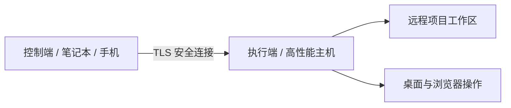

# 自动任务、Bot 与远程设备

[返回目录](Home.md)

GrayCode 不仅是一个桌面交互工作台，还支持自动化后台调度、多平台聊天机器人接入以及跨设备协同工作。

---

## 1. 自动化任务（Automation Tasks）

你可以创建长期在后台静默运行或响应特定事件的自动化任务：

- **任务触发类型**：
  - **目标驱动（Goal-oriented）**：针对明确目标持续迭代推进，直到任务满足完成条件。
  - **定时调度（Cron / Schedule）**：按固定时间间隔或 Cron 表达式定时执行巡检、代码同步或数据处理。
  - **事件监听（Event-driven）**：监听外部 Webhook、文件变更或系统事件并触发响应。
- **任务管理面板**：在左侧面板中直观查看所有任务的运行状态、实时日志、暂停、恢复与历史记录。

---

## 2. 聊天机器人集成（Discord & OneBot / QQ）

GrayCode 支持将 AI 助手接入日常沟通频道，在团队群聊或私聊中协作：

### Discord 机器人
1. 在 **设置 → 机器人 → Discord** 填入 Bot Token 与频道绑定。
2. 支持交互式卡片按钮：对于模型发起的工具操作，群成员可直接在 Discord 消息下方点击“允许”或“拒绝”。
3. 支持长回复流式更新与长对话自动周期性总结。

### OneBot（QQ 机器人）
1. 在 **设置 → 机器人 → OneBot** 配置 WebSocket 连接地址与鉴权 Access Token。
2. 支持私聊与群聊指令交互，任务执行结果与图片附件会原样转发至 QQ 聊天界面。

---

## 3. 多设备配对与远程执行

GrayCode 支持在多台设备之间建立安全配对连接，实现轻量端到端协同：



- **安全认证**：控制端与执行端之间通过专属密钥配对，严格限制远程可访问的工作区目录与操作权限。
- **远程桌面查看与控制**：在移动端或轻薄本上实时查看远端主机的屏幕画面，并进行远程编码、调试与控制。
- **状态同步与断线重连**：断线后后台任务仍持续运行，重新连接后自动同步所有增量事件与输出日志。

---

## 4. Web 工作台

通过启动 Web 服务，你可以在任何现代浏览器中访问 GrayCode 工作台：

```powershell
npm run platform -- serve --web --port 3000
```

- **响应式界面**：完美适配桌面大屏与移动端触屏操作。
- **完整功能矩阵**：包含聊天、工作区文件树、差异审阅、终端与设置等全部核心功能。
