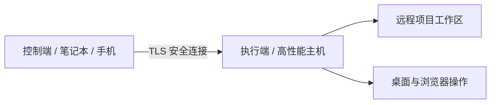

# 自动任务、Bot 与远程设备

[返回目录](Home.md)

GrayCode 不仅是一个桌面交互工作台，还支持自动化后台调度、多平台聊天机器人接入以及跨设备协同工作。

---

## 1. 自动化任务（Automation Tasks）

你可以创建长期在后台静默运行或响应特定事件的自动化任务：

- **任务触发类型**：
  - **目标驱动（Goal-oriented）**：针对明确目标持续迭代推进，直到任务满足完成条件。
  - **定时调度（Schedule）**：按一次性时间、固定分钟间隔，或指定时区的每日时间执行；每日计划可选择一周中的执行日期。
  - **事件监听（Event-driven）**：在指定对话运行完成、工作区文件变化或执行节点上线时触发任务。
- **任务管理面板**：在左侧面板中直观查看所有任务的运行状态、实时日志、暂停、恢复与历史记录。
- **文件监听与退出**：应用退出时会停止正在进行的文件校验，下次启动仍按你选择的方式暂停或恢复监听。定期检查尚未结束时复用本轮检查，避免积压重复读取。
- **来源切换**：暂停并更换事件来源后，旧来源迟到的结果、错误和补发状态不会影响新配置。完成事件保留处理记录以避免重复触发，同一时刻陆续完成的多个任务仍会继续检查。

---

## 2. 聊天机器人集成（Discord & OneBot / QQ）

GrayCode 支持将 AI 助手接入日常沟通频道，在团队群聊或私聊中协作：

### Discord 机器人
1. 在 **设置 → 机器人 → Discord** 填入 Bot Token 与频道绑定。
2. 支持交互式卡片按钮：对于模型发起的工具操作，群成员可直接在 Discord 消息下方点击“允许”或“拒绝”。
3. 支持长回复流式更新与长对话自动周期性总结。
4. 切换对话面板列出当前频道有权访问的最近 200 项，按更新时间分页；其他频道和普通对话不会占用这一上限。

### OneBot（QQ 机器人）
1. 在 **设置 → 机器人 → OneBot** 配置 WebSocket 连接地址与鉴权 Access Token。
2. 支持私聊与群聊指令交互，任务执行结果与图片附件会原样转发至 QQ 聊天界面。

---

## 3. 多设备配对与远程执行

GrayCode 支持在多台设备之间建立安全配对连接，实现轻量端到端协同：


```mermaid
flowchart LR
  A[控制端 / 笔记本 / 手机] -->|TLS 安全连接| B[执行端 / 高性能主机]
  B --> C[远程项目工作区]
  B --> D[桌面与浏览器操作]
```

- **安全认证**：控制端与执行端之间通过专属密钥配对，严格限制远程可访问的工作区目录与操作权限。
- **远程桌面查看与控制**：在移动端或轻薄本上实时查看远端主机的屏幕画面，并进行远程编码、调试与控制。
- **状态同步与断线重连**：断线后后台任务仍持续运行，重新连接后自动同步所有增量事件与输出日志。

模型使用 `computer_windows` 选择实际窗口，可按 `processId`、`processName` 或标题片段 `title` 筛选；默认只返回选择窗口所需的字段，设 `compact: false` 可查看完整信息。选择隐藏宿主窗口时，控制范围会同时纳入它名下的可见窗口；观察会改为其中面积最大的窗口，结果中的 `window.id`、`redirectedFrom` 与说明给出实际目标，后续操作使用这个窗口 ID。

`computer_observe` 对后台窗口先尝试独立截图；无法取得画面且当前任务持有该窗口的有效控制权时，再切到前台截图并在结果中说明。模型在同一有效租约内再次取得控制权时，默认替换目标列表，`mode: "add"` 可追加窗口；人工接管后需要重新授权。输入操作继续要求有效观察，并核实窗口身份、位置、尺寸及控制范围。

---

## 4. Web 工作台

通过启动 Web 服务，你可以在任何现代浏览器中访问 GrayCode 工作台：

```powershell
npm run platform -- --data .tmp/web-local serve --web --port 3000 --token-env GRAYCODE_WEB_TOKEN --key-env GRAYCODE_STORAGE_KEY
```

启动前需构建平台及两部分界面，并设置访问令牌和加密密钥；完整步骤见[CLI 与 Web 模式](Getting-Started.md#5-cli-与-web-模式)。同一数据目录后续启动应使用同一加密密钥。

- **响应式界面**：手机宽度下通过“工作台／返回对话”切换页面，桌面宽度显示文件与聊天面板。
- **完整功能矩阵**：包含聊天、工作区文件树、差异审阅、终端与设置等全部核心功能。
- **事件恢复**：事件同步失败时自动重连补发，必要时重新同步快照；后台模型任务继续运行。
