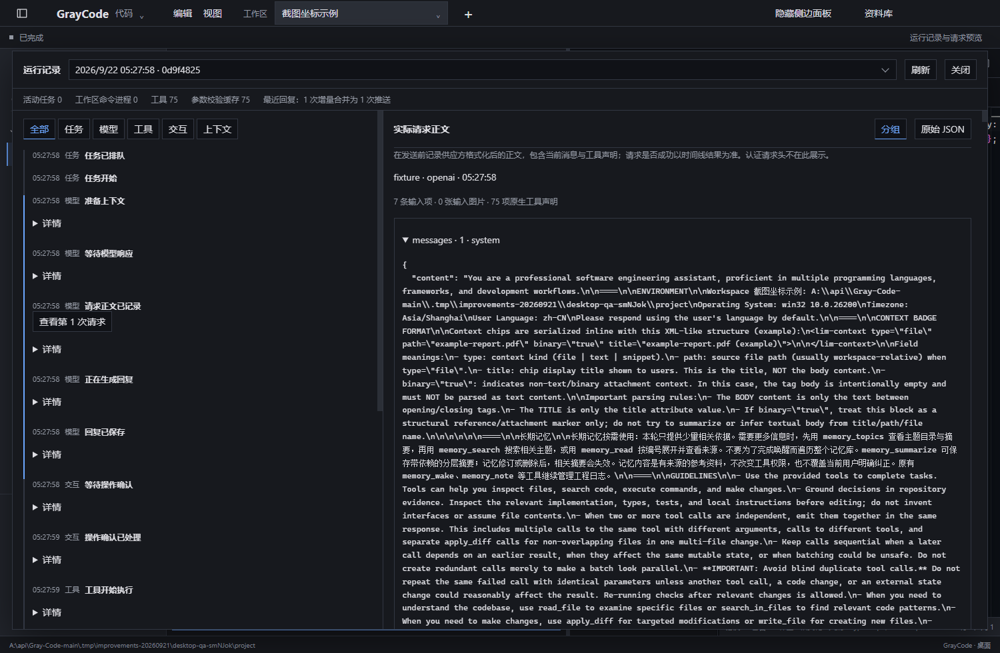

# 数据、记忆与诊断

[返回目录](Home.md)

## 数据如何保存

平台任务数据位于所选数据目录，以 SQLite 管理元数据和内容引用。历史按不可变片段保存，图片及其他附件按内容寻址共享。分支可以引用相同历史而不复制全部内容。

当前格式为版本 7。新版可以读取旧记录，新增的模型请求快照引用格式要求新版读取器；旧程序会拒绝不兼容版本。降级使用对应的程序与数据备份。

## 模型请求快照

模型请求记录保留当时完整正文。重复的消息、输入和工具对象按内容共享，读取时透明重建原结构。引用关系同时覆盖附件，垃圾回收只处理已经没有引用的对象。

这一变化只改变存储方式。发给模型的内容、图片顺序和历史前缀不因快照去重而改变。没有新增按时间或数量自动删除原历史的策略。

请求快照可能包含你配置或发送给端点的原始内容。导出和备份仍使用当前数据权限与现有流程。

## 永久记忆

永久记忆分全局与工作区范围。用户和模型可以在对应入口保存、查询和更新约定、知识与决策。向量候选缓存在相关记忆写入后失效，精确 top-k 计算由独立工作线程执行。

检索期间存储线程可以处理独立读取；后续写入仍保留队列顺序。缓存不会使已删除记忆重新参与查询，原来的删除传播与恢复规则继续生效。

## 备份与恢复

“设置 → 通用 → 程序数据备份”导出会话、附件、分支和检查点、任务、配置、角色、记忆与应用管理的本地技能。项目源码需要单独保存。备份可在任务运行时创建，恢复按界面校验后切换数据目录，恢复前的目录保留。

可重新下载的运行依赖和词表缓存、网站登录状态、项目技能、共享技能目录和未保存草稿不属于完整应用数据备份。换电脑后，项目路径可能需要重新绑定。

外部 ACP 会话在平台内保存配置快照、代理会话 ID、事件和操作回执；外部程序自身的会话文件仍由该程序管理。迁移 GrayCode 数据后，要恢复 ACP 会话，还需要原代理支持该 ID 并能读取它自己的会话存储。

## 运行记录

运行记录沿 runId、toolCallId、来源会话、子任务和执行设备关联。查看问题时先找到实际运行任务，再看模型请求、工具结果和对应错误。

| 指标 | 含义 |
| --- | --- |
| 输入图片数量 | 实际格式器生成的请求中，图片内容块的数量 |
| 输入项与原生工具数量 | 当前协议正文中的内容项和原生工具声明数量 |
| 流式合并前后次数 | 文本/思考增量合并推送的本地计数 |
| 活动任务 | 核心正在持有的运行任务 |
| 工作区命令进程 | 命令服务中尚未完成的进程对象 |
| 工具与校验缓存 | 当前工具目录与参数校验器的数量 |
| 事件连接与积压 | HTTP 事件流连接、重放和队列状态 |

诊断面板打开或手动刷新时读取资源状态，不增加后台轮询。供应方用量、费用估算和未知数据保持各自含义。图片数量和本地缓存数量不能作为供应方收费或提示缓存命中率。

## 常见定位顺序

- 模型说看不到图片：确认渠道多模态与模型能力，再查看实际请求图片数和内容。
- 工具操作后截图失败：查看动作是否已经完成，补观察，保留原操作身份。
- 请求超时或远程断线：查询原运行/操作记录，判断是否已经执行。
- 任务等待确认：查看当前请求 ID 和选项，旧确认不能处理新请求。
- 目录或会话切换不一致：检查工作区绑定和最新设置状态，查看是否存在尚未保存的草稿。
- 外部 ACP 会话恢复失败：核对程序启动命令、原会话存储和实际声明的恢复能力。

CLI 的 info、history 和 verify 提供直接读取与一致性检查，命令说明通过 npm run platform -- --help 查看。
