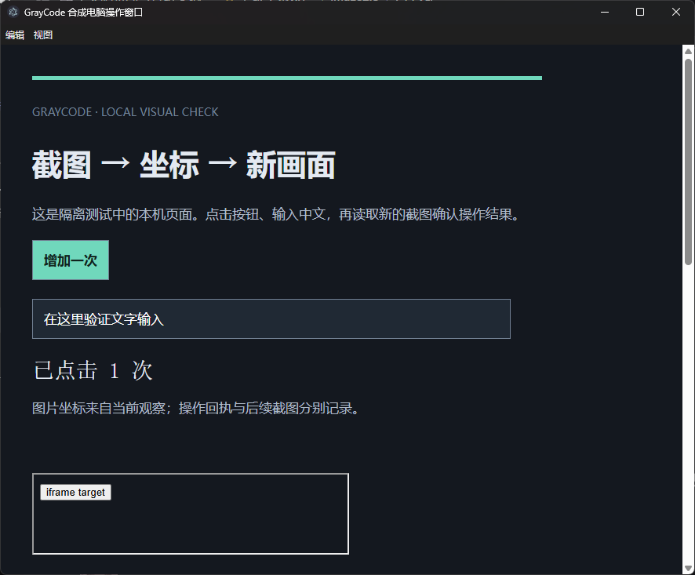

# 截图与坐标工具

[返回目录](Home.md)

电脑和浏览器工具以“观察 → 操作 → 新观察”为基本流程。使用支持图片输入的模型渠道时，模型收到实际图片内容；坐标使用返回图片的像素尺寸。

## 电脑操作

电脑工具先选择窗口并取得控制权，再返回窗口截图、观察 ID、图片尺寸和简要状态。默认截图路径跳过完整 UI Automation 控件树遍历；需要控件名、控件关系或辅助功能操作时，可以明确读取控件树。

图片坐标点击、拖动、滚动、输入和组合键绑定当前观察。截图可能经过缩放，模型应使用图片尺寸中的坐标。宿主依据捕获时窗口位置和比例完成映射。

桌面电脑操作依赖 Windows 原生宿主。可以在控制界面查看宿主状态和当前控制者。远程设备操作还取决于该设备的电脑授权与在线状态。

部分后台窗口的系统共享缩略图与原生窗口边界比例不同，这时会明确要求重新观察。需要直接操作该窗口时，可以先取得焦点，再使用前台窗口的实际区域截图；不会放宽坐标校验去使用比例不匹配的图片。

## 内置浏览器

浏览器工具可以创建、选择、导航和读取标签。截图模式支持图片坐标点击、左右/中键、双击、拖动、组合键、当前焦点输入和定点滚动；已有元素引用、DOM 读取和文件传输继续可用。

每次操作带上生成坐标的观察 ID，宿主检查页面与观察是否仍匹配。执行后返回新的观察，可继续验证按钮是否生效、文字是否输入以及页面是否跳转。

截图采集前等待新的绘制帧，避免鼠标滚轮请求已经提交、画面仍停在操作前位置。

后台标签保持同一页面与浏览器会话，能够继续绘制并截图。打开面板接管和切回后台沿用该页面，不另建一份登录会话。后台绘制会占用相应页面资源，标签与任务的生命周期由浏览器服务管理。

## 操作结果的含义

| 状态 | 如何理解 |
| --- | --- |
| 已完成 | 宿主已经执行动作；后续观察用于判断页面或应用结果 |
| 已失败 | 已有明确失败原因，按原因重新观察或修正参数 |
| 结果未知 | 已派发但无法确认结果，先查询原操作或观察当前画面 |
| 动作完成、截图失败 | 动作回执保留，截图错误单独返回；补一次观察即可 |
| 重复请求 | 使用相同操作身份取回回执，避免再次执行同一动作 |

窗口移动、缩放、导航、焦点或控制权变化可能使旧观察失效。电脑用户可以通过人工输入或配置的停止快捷键接管，具体状态以控制界面为准。

## 远程画面

配对设备页面可以选择窗口或显示器、观看画面、取得和释放控制权，并提供适合手机与中文输入法的文字输入区。新设备声明图片坐标版本和动作列表；旧设备缺少这些可选字段时仍按原协议工作。

远程画面在面板隐藏、打开设置或页面切到后台时停止连续采集并释放控制权。关闭期间迟到取得的控制权也会释放；动作完成后的截图失败单独提示，不覆盖动作本身的回执或错误。

连接断开会释放对应远程控制，任务和操作记录保留。重新连接补取状态和结果，不重发已经派发的命令。显示器预览与窗口操作的目标范围由各自入口决定。

## 图片处理

裁切、缩放和旋转在同一处理链中生成目标格式，省去中间图片的编码与再次解码。PNG 保持无损输出，JPEG/WebP 沿用原有质量参数；旋转到支持透明的格式时，空白区域保留透明度。原文件读取、目标路径写入和是否把图片返回模型，继续遵循对应工具配置。

处理方式依据 [Sharp 输出接口](https://sharp.pixelplumbing.com/api-output/#tobuffer)。实际输出通过三种操作与三种格式的真实编码用例核对，尺寸、文件内容与工具附件一致。

## 图片保存与验证范围

截图作为工具附件进入历史，后续请求保持已有图片顺序。每轮自动只留下最新截图的策略已移除。模型渠道的图片能力配置见[模型与上下文](Models-and-Context.md)。

开发验证使用真实 Electron 页面与本机可控端点检查坐标、缩放、输入、拖动和重复操作，并使用隔离节点检查断线恢复。混合 DPI、多屏组合、真实手机和外部视觉模型仍需对应环境验证。已执行结果见[性能与验证](Performance-and-Validation.md)。
